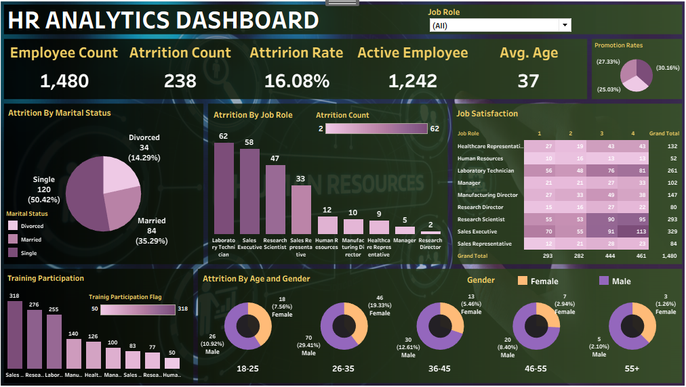

# 👨‍💼 HR Analytics Dashboard - Tableau

## 🚀 Overview
This project presents an interactive HR analytics dashboard built using Tableau to analyze employee attrition, workforce demographics, and job satisfaction.

The dashboard helps identify key factors affecting employee turnover and supports HR decision-making through data-driven insights.

## 📸 Dashboard Preview

## 📊 Key Features
- Employee attrition analysis by job role, age, and gender
- Workforce distribution and demographics insights
- Job satisfaction breakdown across roles
- Training participation tracking
- Promotion rate analysis
- Interactive filters (Job Role)

## 📈 KPIs
- Total Employees: 1,480  
- Attrition Count: 238  
- Attrition Rate: 16.08%  
- Active Employees: 1,242  
- Average Age: 37  

## 🔍 Key Insights
- The overall attrition rate is relatively high at 16%, indicating potential retention challenges.  
- Laboratory Technicians and Sales Executives show the highest attrition levels, suggesting role-specific issues.  
- Employees aged 26–35 represent the largest group leaving the company, highlighting a critical retention segment.  
- Job satisfaction varies significantly across roles, with some positions showing lower satisfaction scores.  
- A noticeable gender imbalance exists across age groups, which may impact workforce dynamics.  
- Training participation differs across departments, indicating opportunities to improve employee engagement.  
- Promotion rates are uneven, which could influence employee retention and motivation.  

## 🛠 Tools Used
- Tableau  
- Data Visualization  
- Data Analysis  

## 📌 How to Use
1. Open the Tableau file (.twb/.twbx)
2. Interact with filters to explore insights
3. Analyze attrition patterns across different dimensions

## 👤 Author
Mohamed Ibrahim
